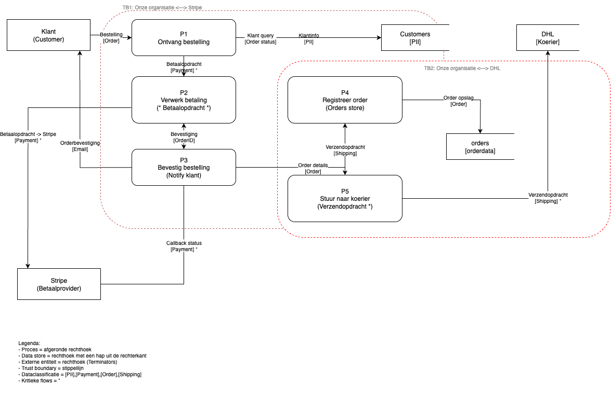

# Building Block — Gedeeltelijke DFD

**Waarom dit?**  
Dit is een **building block**: een essentieel puzzelstuk voor je **eindproduct: risicoprofieladvies**. Je maakt geen complete DFD, maar één **gedeeltelijke DFD**: een **slice** (deelketen) van een echt bedrijf of organisatie **naar keuze**.  
*Voorbeelden (alleen ter inspiratie):*  
- **Checkout + betaling** met een **externe betaalprovider** (zoals Adyen). Zo’n provider staat **buiten** jouw organisatie en is in je DFD een **externe entiteit (Terminator)**.  
- **Orderverzending** via een **externe fulfilmentpartner** (denk aan een webwinkel die magazijn/verzending uitbesteedt).  
- **Login + sessie-uitgifte** naar een klantportal.

**Richttijd:** 90–120 min  
**Beoordeling:** **Go / No Go** (100% nagekeken)  
**Inleveren:** **alleen PDF** in de DLO  
**Deadline:** **zondag 14 september 2025, 23:59 (Amsterdam-tijd)**

---

## Wat ga je opleveren (vul dit in deze Markdown in)
1. **Korte scope (2–3 zinnen)** — wat is precies jouw slice (deelketen)?  
2. **Externe entiteiten** — wie/wat staat buiten jouw organisatie?  
3. **Gedeeltelijke DFD (Level-0)** — **voeg hier de afbeelding in deze Markdown toe**.  
4. **Trust boundary(’s)** — benoem duidelijk, bijv. “Onze organisatie ↔ Betaalprovider” of “Onze organisatie ↔ Fulfilmentpartner”.  
5. **Kritieke flow(s)** over de boundary — markeer in het label met `*`.  
6. **Assumpties (3–5 bullets)** — afbakening & aannames.  
7. **Korte legend (max 5 bullets)** — symbolen/labels die je gebruikt.  
8. **Optioneel: dataclassificatie in labels** — bijv. `[Auth]`, `[PII]`, `[Payment]`.

> **Tools:** je mag kiezen (draw.io/diagrams.net, Excalidraw, Visio, yEd…). Exporteer uiteindelijk naar **PDF**.

---

## Eisen (Level-0, strak en leesbaar)
- **3–5 processen** (P1–P5) die echt bij de slice horen.  
- **1–2 data stores** die de slice gebruikt.  
- **2–3 externe entiteiten** (minimaal de klant + één externe partij).  
- **Alle flows zijn informatie** (duidelijke labels: *Betaalopdracht*, *Callback*, *Orderstatus*). **Geen fysieke goederen** als flow.  
- **Geen verboden flows:** geen *entiteit → store* en geen *store ↔ store*; **alles via processen**.  
- **Elk proces heeft I/O** (minstens één inkomende én één uitgaande flow).  
- **Minstens één trust boundary benoemd** + **minstens één flow die die boundary kruist**.  
- **Abstractie = Level-0**: geen crypto/SQL-details; denk in functies (*Verwerk Betaling*, *Registreer Order*).

> **Trust boundary, informeel:** de **scheidslijn tussen “buiten” en “binnen”**. Alles wat de lijn overgaat, **controleer je extra** (authenticatie/validatie/logging).

---

## Template — vul dit hieronder in

# Building Block — Gedeeltelijke DFD (Gym-kleding webshop)

### 1) Scope (2–3 zinnen)
Deze slice beschrijft het **checkout en betaaltraject** van een online webshop voor sportswear.
Het omvat het plaatsen van de bestelling door de klant, de doorgeleiding van de betaalopdracht naar Stripe, en de bevestiging en registratie van de order binnen onze webshop. De uiteindelijke verzendopdracht naar een externe koerier (DHL) is ook inbegrepen.

### 2) Externe entiteiten
- **Klant** (Customer)
- **Stripe** (Betaalprovider)
- **DHL** (Koerier / Fulfilmentpartner)

### 3) Gedeeltelijke DFD (Level-0)
 

zie bijgevoegde document gedeeltelijke-dfd-wessel.pdf

### 4) Trust boundary(’s)
- **TB1:** Onze organisatie <-> Stripe (betaalprovider)
- **TB2:** Onze organisatie <-> DHL (fulfilment / koerier)

### 5) Kritieke boundary-flows (markeer met `*`)
- `*` **Betaalopdracht** (P2 Verwerk betaling > Stripe)
- `*` **Callback payment status** (Stripe > P2 Verwerk betaling)
- `*` **Verzendopdracht** (P5 Stuur naar fulfilment > DHL)

### 6) Assumpties (3–5 bullets)
- Stripe is verantwoordelijk voor het verweken van carddata tot hun standaarden, onze webshop stuurt alleen noodzakelijke betalingsdata.
- DHL ontvangt alleen de benodigde verzendinformatie en verwerkt geen gevoelige betalingsdata.
- Klantaccounts bewaren we in de Customers datastore, orders worden in Orders opgeslagen. Alleen minimaal noodzakelijke PII(personally identiediable information) wordt opgeslagen.
- Alle flows tussen klant, onze processen en externe partijen verlopen over beveiligde verbindingen (TLS), tenzij expliciet anders aangegeven.  

### 7) Legend (max 5 bullets)
- **Proces** = Ronde rechthoek met P1–P5 (P1 Ontvang bestelling)
- **Data store** = Rechthoek met een hap uit de rechterkant (Customers, Orders)
- **Externe entiteit (Terminator)** = Rechthoek zonder (Stripe, DHL)
- **Labelconventies** = `[PII]`, `[Payment]`, `[Order]`, `[Shipping]` in flowlabels
- **Trust boundary** = Dikke rode stippellijn, flows die de lijn kruisen vereisen extra controles

---

## Checklist voor jezelf (B1–B12)
*(Deze checklist is voor jou; wij beoordelen op basis van de acceptatiecriteria hieronder.)*
- [x] **B1 — Scope beschreven** (concreet, 2–3 zinnen)  
- [x] **B2 — Externe entiteiten benoemd** (min. klant + 1 externe partij)  
- [x] **B3 — DFD-afbeelding aanwezig** (alleen jouw slice)  
- [x] **B4 — Correcte symboliek** (proces, store, entiteit, flow)  
- [x] **B5 — Geen verboden flows** (geen entiteit→store / store↔store)  
- [x] **B6 — Elk proces heeft I/O** (geen “los” proces)  
- [x] **B7 — Alle flows gelabeld** (informatie, geen goederen)  
- [x] **B8 — ≥1 trust boundary benoemd**  
- [x] **B9 — ≥1 flow kruist de boundary** (met `*` gemarkeerd)  
- [x] **B10 — Assumpties (≥3) aanwezig**  
- [x] **B11 — Legend aanwezig** (max 5 bullets)  
- [x] **B12 — Level-0 abstractie aangehouden**

---

## Acceptatiecriteria (beoordeling **Go / No Go**)
Je krijgt **Go** als **alle** onderstaande punten kloppen; anders **No Go**.
1. **Deliverables compleet:** Scope (2–3 zinnen), externe entiteiten, DFD-afbeelding, boundary-namen, gemarkeerde kritieke flow(s), ≥3 assumpties, korte legend.  
2. **DFD-regels gevolgd:** correcte symboliek; **geen** entiteit→store of store↔store; **alle processen hebben I/O**; **alle flows zijn informatie en gelabeld**.  
3. **Boundary zichtbaar en relevant:** minimaal één **benoemde** trust boundary én minimaal één **kritieke flow** die die boundary **kruist** (gemarkeerd met `*`).  
4. **Abstractie klopt:** **Level-0** (geen crypto/SQL-details); leesbaar en consistent.  
5. **Aanlevering klopt:** het bestand dat je inlevert in de DLO is **één PDF** waarin deze ingevulde Markdown-inhoud en je DFD-afbeelding **duidelijk zichtbaar** zijn (bestandsnaam: `bb-gedeeltelijke-dfd-<achternaam>-<klas>.pdf`).

---

## Inleveren (alleen PDF)
1. Commit/push deze **Markdown + afbeelding** in je GitLab-repo.  
2. **Converteer deze Markdown naar één PDF** (de DFD-afbeelding moet zichtbaar zijn).  
3. Lever **de PDF** in bij de DLO-opdracht **“Building Block — Gedeeltelijke DFD”**.  
4. **Deadline:** **zondag 14 september 2025, 23:59 (Amsterdam-tijd)**.

---

## Veelgemaakte fouten (mijd deze)
- Fysieke goederen als data-flow tekenen i.p.v. de **informatie** (gebruik labels als *Verzendopdracht*, *Track&Trace*, *Betaalstatus*).  
- Een externe partij (betaalprovider/fulfilment) als **proces** tekenen i.p.v. **externe entiteit** (Terminator).  
- **Store ↔ store** of **entiteit → store**; altijd via een **proces**.  
- Boundary **niet benoemen** of **geen flow** laten kruisen.  
- Te veel detail op **Level-0** (hashing, token-formats, SQL-queries).
